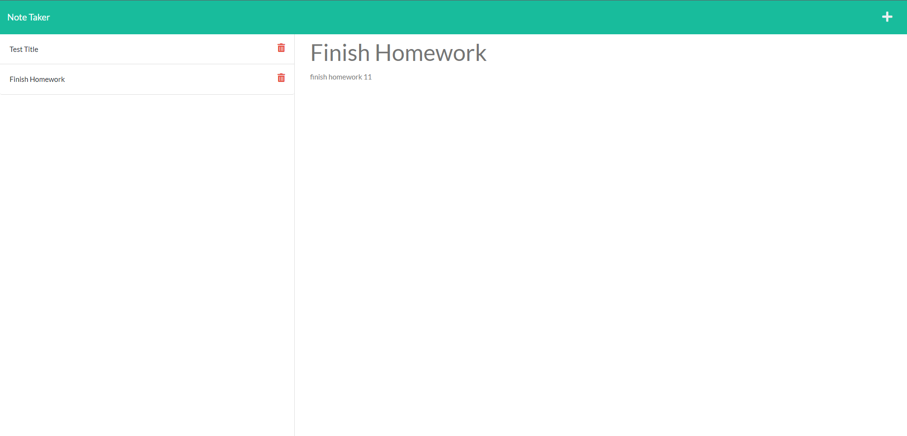

# HW-11 Note Taker

## Description

This is a note taking application. When a user opens the application. A user is presented with a landing page with a link to the note taking page. When the user clicks on the link to the note page, they are presented with a page with existing notes listed in the left-hand column, plus empty fields to enter new notes. When a user enters a new note's title and text content a save icon appears in the navigation. When the user clicks this save icon, the new note is saved and appears on the left hand side with other existing notes. A user can click on existing note to view it on the right-hand column. The user may click the write icon in the navigation and will be presented with empty fields to enter a new note title and the note’s text in the right-hand column.

## Screenshot

## Links to Application

- Here is the Github repo: https://github.com/mhaddadin1/HW-11
- Here is the deployed app on Heroku: https://hw11-note-taker-mousa.herokuapp.com/

## Questions

If you have any questions, you may contact: mousahaddadin@gmail.com
